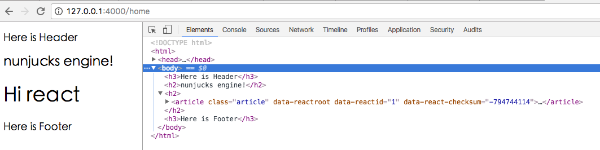
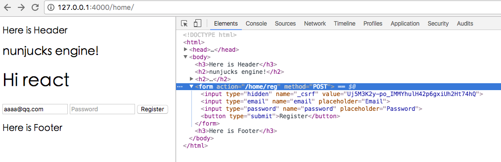

https://www.smashingmagazine.com/2016/08/getting-started-koa-2-async-functions/

```
npm install -c
#  -c, --china: specify in china, will automatically using chinses npm registry and other binary's mirrors
```

如果没有安装 devDependencies 的模块，是因为环境变量 NODE_ENV=production ，所以不会安装开发依赖包

```
$ ENV | grep NODE
NODE_PATH=/Applications/Atom.app/Contents/Resources/app.asar/exports
NODE_ENV=production
ELECTRON_RUN_AS_NODE=1

export NODE_ENV=development
```
再执行安装即可，部分依赖包可能会因网络慢安装失败，可重复多次执行 `npm install -c`,直到所有依赖包都安装完。

###  setp 1 : `koa2 + babel` , run simple app for node.js

see package.json :
```js
"dependencies": {
  "babel-polyfill": "^6.20.0",
  "koa": "^2.0.0-alpha.7",
},
"devDependencies": {
  "babel-cli": "^6.18.0",
  "babel-preset-es2015": "^6.18.0",
  "babel-preset-stage-3": "^6.17.0",
  "babel-register": "^6.18.0",
},
"babel": {
  "presets": [
    "es2015",
    "stage-3"
  ]
}
```
so, need to install dependencies:

```
npm install --save \
  # babel-polyfill provides the runtime that async functions need
  babel-polyfill \
  # The Koa framework itself
  koa@next \

npm install --save-dev \
   # Babel CLI to build our app
   babel-cli \
   # A set of Babel plugins to support ES6 features
   babel-preset-es2015 \
   # and to support stage-3 features
   babel-preset-stage-3 \
   # Overrides Node.js's require and compiles modules at runtime
   babel-register \
```

then,  create index.js like this :
```js
//babel-polyfill provides the runtime that async functions need
require('babel-polyfill');

//Overrides Node.js's require and compiles modules at runtime
require('babel-register');

const port = 4000;
const app = require('./app/index').default;
app.listen(port, () => console.log(`Listening on port ${port}.`));
```

we put the app index.js into app folder , make it :

```js
import Koa from 'koa';

// //Create the app from the ES6 class.
const app = new Koa();

app.use(async (ctx, next) => ctx.body = 'Hello World');

export default app;
```

finaly, run by node command :  
`node index`

```js
$ node index
Listening on port 4000.
```

and then , app directory structure looks like this:
```js
kwan/
    |app/
        |index.js
    node_modules
    index.js
    package.json
    README.md
```


### step 2 : `koa2 + babel + eslint + koa-router + react`, support eslint and react


```
npm install --save \
    react react-dom
    koa-router@next
    babel-preset-react

npm install --save-dev \
   # eslint and use airbnb config , support react
   eslint eslint-config-airbnb eslint-plugin-jsx-a11y@2.2.3 eslint-plugin-import eslint-plugin-react babel-eslint

```

see [Airbnb JavaScript Style Guide](https://github.com/airbnb/javascript)

edit .eslintrc config file :
```
{
  "extends": ["eslint:recommended", "plugin:react/recommended"],
  "parserOptions": {
    "ecmaVersion": 6,
    "sourceType": "module"
  },
  "parser": "babel-eslint",
  "root": true,
  "env": {
    "browser": true,
    "es6": true,
    "node": true
  },
  "plugins": [
    "react"
  ],
  "rules": {
      "strict": 0,
      "indent": [2, 2, {"SwitchCase": 1}]
  }
}
```

edit package.json , add script :

```js
"scripts": {
  "start-dev": "./node_modules/.bin/rollup -c config/rollup/dev.js",
  "lint": "eslint . --ext .js",
},
```

then , run script:

`npm run lint`  see the result:

```
$ npm run lint

> kwen@1.0.0 lint D:\work\project\kwen
> eslint . --ext .js

D:\work\project\kwen\app\index.js
  1:23  error  Expected linebreaks to be 'LF' but found 'CRLF'     linebreak-style
  2:1   error  Expected linebreaks to be 'LF' but found 'CRLF'     linebreak-style
  3:40  error  Expected linebreaks to be 'LF' but found 'CRLF'     linebreak-style
  4:23  error  Expected linebreaks to be 'LF' but found 'CRLF'     linebreak-style
  5:1   error  Expected linebreaks to be 'LF' but found 'CRLF'     linebreak-style
  6:9   error  Arrow function should not return assignment         no-return-assign
  6:21  error  'next' is defined but never used                    no-unused-vars
  6:30  error  Assignment to property of function parameter 'ctx'  no-param-reassign
  6:56  error  Expected linebreaks to be 'LF' but found 'CRLF'     linebreak-style
  7:1   error  Expected linebreaks to be 'LF' but found 'CRLF'     linebreak-style
  8:20  error  Expected linebreaks to be 'LF' but found 'CRLF'     linebreak-style

```

create Controller app/controllers/home.js:
```js
import React from 'react';
import fs from 'fs';
import { renderToString } from 'react-dom/server';
import Articles from '../components/article.jsx';

const index = async (ctx) => {
  const prerenderHtml = await renderToString(
    <Articles  />
  );
  ctx.body = prerenderHtml;
};

const about = async (ctx) => {
  const readme = await fs.readFileSync('README.md', 'utf8');
  ctx.body = readme;
};

export default {
  index,
  about
};
```

create jsx file app/components/article.jsx
```js
import React, { Component }  from 'react';

class Article extends Component {
  constructor(props) {
    super(props);
  }

  render() {
    return (
      <article className="article">
        <h2 className="article-title">
            Hi react
        </h2>
      </article>
    );
  }
}
export default Article;
```

到这里我们通常会问：怎么访问控制器home下的index方法呢？ 添加路由! [](https://ecmadao.gitbooks.io/learn-koa2/content/router.html)

create router folder , and create index.js for router index :
```js
import fs from 'fs';
import path from 'path';
import Router from 'koa-router';
import home from '../controllers/home';

const basename = path.basename(module.filename);
const router = Router();

fs
  .readdirSync(__dirname)
  .filter(function(file) {
    return (file.indexOf('.') !== 0) && (file !== basename) && (file.slice(-3) === '.js');
  })
  .forEach(function(file) {
    let route = require(path.join(__dirname, file));
    router.use(route.routes(), route.allowedMethods());
  });
// default controller.action for http://your-domain/
router.get('/', home.index);

export default router;
```

vi app/index.js support router:
```js
import Koa from 'koa';
import router from './routers';

// Create the app from the ES6 class.
const app = new Koa();

// use koa-router
app.use(router.routes(), router.allowedMethods());

//app.use(async (ctx) => { const c = ctx; c.body = c; });

export default app;

```
create router home.js in app/routers/ folder :
```js
import Router from 'koa-router';
import home from '../controllers/home';

const router = Router({
  prefix: '/home'
});

router.get('/', home.index);
router.get('/about', home.about);

// for require auto in index.js
module.exports = router;

```

here we go, start app : `node index` , and browser http://127.0.0.1:4000/home/ , should be show "Hi react".


### step 3 : `koa2 + babel + eslint + koa-router + react + nunjucks `, support template
```
npm install --save \
    koa-views@next
    nunjucks

npm install --save-dev \

```

#### 1. vi app/index.js :

```js
import Koa from 'koa';
import views from 'koa-views';
import router from './routers';

// Create the app from the ES6 class.
const app = new Koa();

// use nunjucks template
app.use(views(__dirname + '/views', { extension: 'tpl', map: { tpl: 'nunjucks' } }));

app.use(router.routes(), router.allowedMethods());

export default app;
```

#### 2. create views files ,
```
app/
   -views/
        -home/
            index.tpl
        -layout/
            layout.tpl
            header.tpl
            footer.tpl
```

#### 3. vi app/controllers/home.js
```js
const index = async (ctx) => {
  // react server render
  const prerenderHtml = await renderToString(
    <Articles  />
  );
  await ctx.render("home/index.tpl", {title: "nunjucks engine!", jsx:prerenderHtml });
};
```

#### 4. http://127.0.0.1:4000/home



### step 4 : `koa2 + babel + eslint + koa-router + react + nunjucks +  koa-log4  `, support koa-log4
```
npm install --save \
    koa-log4@2

npm install --save-dev \

```
create logger configuretion file :
```
{
  "appenders": [
    {
      "type": "console"  // replacement console.log
    },
    {
      "type": "clustered",  
      "appenders": [
        {
          "type": "dateFile",
          "filename": "access.log",
          "pattern": "-yyyy-MM-dd.bak",
          "category": "http"
        },
        {
          "type": "logLevelFilter",
          "level": "ERROR",
          "appender": {
              "type": "dateFile",
              "filename": "error.log",
              "pattern": "-yyyy-MM-dd.bak",
              "category": "error"
          }
        }
      ]
    }
  ]
}
```

edit app/index.js :
```js
import Koa from 'koa';
import path from 'path';
import fs from 'fs';
import views from 'koa-views';
import log4js from 'koa-log4';
import router from './routers';

const appDir = path.resolve(__dirname, '..');
const logDir = path.join(appDir, 'logs');
/**
 * make a log directory, just in case it isn't there.
 */
try {
  fs.mkdirSync(logDir);
} catch (e) {
  if (e.code != 'EEXIST') {
    process.exit(1);
  }
}
log4js.configure(path.join(appDir, 'log4js.json'), { cwd: logDir, reloadSecs: 1 });

// Create the app from the ES6 class.
const app = new Koa();

const logger = log4js.getLogger('http');
app.use(log4js.koaLogger(logger, { level: 'auto' }));

// use nunjucks template
app.use(views(__dirname + '/views', { extension: 'tpl', map: { tpl: 'nunjucks' } }));

// use koa-router router
app.use(router.routes(), router.allowedMethods());

export default app;

```

and run `node index.js` , will be see log file in logs folder ：

```
2016-12-30 13:34:01.509] [ERROR] http - ::ffff:127.0.0.1 - - "GET /assets/css/main.css HTTP/1.1" 404 - "http://127.0.0.1:4000/home" "Mozilla/5.0 (Macint
osh; Intel Mac OS X 10_11_4) AppleWebKit/537.36 (KHTML, like Gecko) Chrome/54.0.2840.98 Safari/537.36"
[2016-12-30 13:34:39.191] [ERROR] http - ::ffff:127.0.0.1 - - "GET /assets/css/main.css HTTP/1.1" 404 - "http://127.0.0.1:4000/home" "Mozilla/5.0 (Macint
osh; Intel Mac OS X 10_11_4) AppleWebKit/537.36 (KHTML, like Gecko) Chrome/54.0.2840.98 Safari/537.36"
```

分类记录日志，把debug和错误日志分开，修改 log4js.json 文件：
```
{
  "appenders": [
    {
      "type": "console"
    },
    {
      "type": "clustered",
      "appenders": [
        {
          "category": "http",
          "type": "logLevelFilter",
          "level": "WARN",
          "maxLevel": "FATAL",
          "appender": {
              "type": "dateFile",
              "filename": "error.log",
              "pattern": "-yyyy-MM-dd.bak"
          }
        },
        {
          "category": "http",
          "type": "logLevelFilter",
          "level": "TRACE",
          "maxLevel": "DEBUG",
          "appender": {
              "type": "dateFile",
              "filename": "debug.log",
              "pattern": "-yyyy-MM-dd.bak"
          }
        }

      ]
    }
  ]
}
```

app/index.js :
```js
import Koa from 'koa';
import path from 'path';
import fs from 'fs';
import views from 'koa-views';
import log4js from 'koa-log4';
import router from './routers';

const appDir = path.resolve(__dirname, '..');
const logDir = path.join(appDir, 'logs');
/**
 * make a log directory, just in case it isn't there.
 */
try {
  fs.mkdirSync(logDir);
} catch (e) {
  if (e.code != 'EEXIST') {
    process.exit(1);
  }
}
log4js.configure(path.join(appDir, 'log4js.json'), { cwd: logDir, reloadSecs: 1 });

// Create the app from the ES6 class.
const app = new Koa();

const logger = log4js.getLogger('http');
app.use(log4js.koaLogger(logger, { level: 'auto' }));

// use nunjucks template
app.use(views(__dirname + '/views', { extension: 'tpl', map: { tpl: 'nunjucks' } }));

// use koa-router router
app.use(router.routes(), router.allowedMethods());

logger.trace('this is trace');
logger.debug('this is debug');
logger.info('this is info');
logger.warn('this is warn');
logger.error('this is error');
logger.fatal('this is fatal');

export default app;

```

run `node index`

```
$ node index.js

[2016-12-30 13:56:19.282] [TRACE] http - this is trace
[2016-12-30 13:56:19.285] [DEBUG] http - this is debug
[2016-12-30 13:56:19.286] [INFO] http - this is info
[2016-12-30 13:56:19.286] [WARN] http - this is warn
[2016-12-30 13:56:19.287] [ERROR] http - this is error
[2016-12-30 13:56:19.287] [FATAL] http - this is fatal
```

```
$ ls -l logs
total 16
-rw-r--r--  1 caidavis  staff  110 Dec 30 13:56 debug.log
-rw-r--r--  1 caidavis  staff  163 Dec 30 13:56 error.log
```

### step 5 : `koa2 + babel + eslint + koa-router + react + nunjucks +  logger +  koa-csrf  `, support csrf
```
npm install --save \
koa-csrf@3.x
koa-session-minimal
koa-bodyparser@next

npm install --save-dev \

```

app/index.js :
```js
import Koa from 'koa';
import path from 'path';
import fs from 'fs';
import views from 'koa-views';
import log4js from 'koa-log4';
import bodyParser from 'koa-bodyparser';
import session from 'koa-session-minimal';
import csrf from 'koa-csrf';
import router from './routers';

const appDir = path.resolve(__dirname, '..');
const logDir = path.join(appDir, 'logs');

/**
 * make a log directory, just in case it isn't there.
 */
try {
  fs.mkdirSync(logDir);
} catch (e) {
  if (e.code != 'EEXIST') {
    process.exit(1);
  }
}
log4js.configure(path.join(appDir, 'log4js.json'), { cwd: logDir, reloadSecs: 1 });
const logger = log4js.getLogger('http');


// Create the app from the ES6 class.
const app = new Koa();

// support session,  csrf need it
app.use(session());

// support body parser
app.use(bodyParser());

// use log4js logger
app.use(log4js.koaLogger(logger, { level: 'auto' }));

// use nunjucks template
app.use(views(__dirname + '/views', { extension: 'tpl', map: { tpl: 'nunjucks' } }));

// add the CSRF middleware
app.keys = ['secret'];
app.use(new csrf({
  invalidSessionSecretMessage: 'Invalid session secret',
  invalidSessionSecretStatusCode: 403,
  invalidTokenMessage: 'Invalid CSRF token',
  invalidTokenStatusCode: 403,
}));

// use koa-router router
app.use(router.routes(), router.allowedMethods());

export default app;

```

app/controllers/home.js :
```js
import React from 'react';
import fs from 'fs';
import { renderToString } from 'react-dom/server';
import Articles from '../components/article.jsx';

const index = async (ctx) => {
  const prerenderHtml = await renderToString(
    <Articles  />
  );
  // set csrf = ctx.csrf
  await ctx.render("home/index.tpl", {title: "nunjucks engine!", jsx:prerenderHtml, csrf:ctx.csrf });
};

const reg = async (ctx) => {
  await ctx.render("home/reg.tpl", {title:"reg"});
};

const about = async (ctx) => {
  const readme = await fs.readFileSync('README.md', 'utf8');
  ctx.body = readme;
};

export default {
  index,
  reg,
  about
};

```

app/views/index.tpl :
```



<!--head block-->

<link type="text/css" href="assets/css/main.css" rev="stylesheet" rel="stylesheet"  />


<!--body block-->

<h2>{{title}}</h2>
<h2>{{jsx | safe }}</h2>

<form action="/home/reg" method="POST">
  <input type="hidden" name="_csrf" value="{{ csrf }}" />
  <input type="email" name="email" placeholder="Email" />
  <input type="password" name="password" placeholder="Password" />
  <button type="submit">Register</button>
</form>



```
 app/router/home.js :
 ```js
 import Router from 'koa-router';
 import home from '../controllers/home';

 const router = Router({
   prefix: '/home'
 });

 router.get('/', home.index);
 router.get('/reg', home.reg);
// for post
 router.post('/reg', home.reg);
 router.get('/about', home.about);

 // for require auto in index.js
 module.exports = router;

 ```

 create reg page , app/views/home/
 ```
 
 

 <!--body block-->
 
 <h2>{{title}}</h2>
 
 ```

 run `node index`, http://127.0.0.1:4000/home/ :




#### fix `Invalid CSRF token`:
http://stackoverflow.com/questions/35362507/why-need-more-than-one-secret-key-on-koa

importance: csrf need to install body parser and session store


### step 6 : `koa2 + babel + eslint + koa-router + react + nunjucks +  logger + koa-csrf + koa-i18n `, support i18n
```
npm install --save \
koa-i18n
koa-locale
koa-convert

npm install --save-dev \

```
https://github.com/koa-modules/i18n

app/index.js
```js
import Koa from 'koa';
import path from 'path';
import fs from 'fs';
import views from 'koa-views';
import log4js from 'koa-log4';
import bodyParser from 'koa-bodyparser';
import session from 'koa-session-minimal';
import csrf from 'koa-csrf';
import convert from 'koa-convert';
import locale from 'koa-locale';
import i18n from 'koa-i18n';
import router from './routers';

const appDir = path.resolve(__dirname, '..');
const configDir = path.resolve(__dirname, './config');
const logDir = path.join(appDir, 'logs');

/**
 * make a log directory, just in case it isn't there.
 */
try {
  fs.mkdirSync(logDir);
} catch (e) {
  if (e.code != 'EEXIST') {
    process.exit(1);
  }
}
log4js.configure(path.join(appDir, 'log4js.json'), { cwd: logDir, reloadSecs: 1 });
const logger = log4js.getLogger('http');


// Create the app from the ES6 class.
const app = new Koa();

// for i18n
locale(app);
// support i18n
app.use(convert(i18n(app, {
  directory: configDir + '/locales',
  locales: ['zh-cn', 'en'], //  `zh-cn` defualtLocale, must match the locales to the filenames
  modes: [                  //  If one mode is detected, no continue to detect.
    'query',                //  optional detect querystring - `/?locale=en-US`
    'subdomain',            //  optional detect subdomain   - `zh-CN.koajs.com`
    'cookie',               //  optional detect cookie      - `Cookie: locale=zh-TW`
    'header',               //  optional detect header      - `Accept-Language: zh-CN,zh;q=0.5`
    'url',                  //  optional detect url         - `/en`
    'tld'                  //  optional detect tld(the last domain) - `koajs.cn`
  ]
})));

// support session,  csrf need it
app.use(session());

// support body parser
app.use(bodyParser());

// use log4js logger
app.use(log4js.koaLogger(logger, { level: 'auto' }));

// use nunjucks template
app.use(views(__dirname + '/views', { extension: 'tpl', map: { tpl: 'nunjucks' } }));

// add the CSRF middleware
app.keys = ['secret'];
app.use(new csrf({
  invalidSessionSecretMessage: 'Invalid session secret',
  invalidSessionSecretStatusCode: 403,
  invalidTokenMessage: 'Invalid CSRF token',
  invalidTokenStatusCode: 403,
}));

// use koa-router router
app.use(router.routes(), router.allowedMethods());

/*
logger.trace('this is trace');
logger.debug('this is debug');
logger.info('this is info');
logger.warn('this is warn');
logger.error('this is error');
logger.fatal('this is fatal');
*/

export default app;
```

create locales files:
```
app/config/
        /locales/
                | en.js
                | zh-cn.js
```

vi zh-cn.js:
```
{
  "app.subtitle":"kwan 基于Koa2构建的Node.js开发框架",
  "locales.en": "英文",
  "locales.zh-CN": "简体中文",
  "i18n": "国际化与本地化"
}
```

vi en.js
```js
{
   "app.subtitle":"kwan is base on Koa2 for node.js",
  "locales.en": "English",
  "locales.zh-CN": "Chinese(Simplified)",
  "i18n": "Internationalization and Localization"
}
```

app/controllers/home.js
```js
const index = async (ctx) => {
  const prerenderHtml = await renderToString(
    <Articles  />
  );
  let subTitle = ctx.i18n.__('app.subtitle');
  await ctx.render("home/index.tpl", {
    title: "nunjucks engine!",
    jsx:prerenderHtml,
    csrf:ctx.csrf,
    subTitle:subTitle
  });
};

```

app/views/home/index.tpl:
```
<!--body block-->

<h2>{{title}}</h2>
<h2>{{subTitle}}</h2>
<h2>{{jsx | safe }}</h2>

```


### step 7 : `koa2 + babel + eslint + koa-router + react + nunjucks +  logger + koa-csrf + koa-i18n + ava `, support test
```
npm install --save \

npm install --save-dev \
ava
supertest supertest-as-promised
nyc
```


vi package.json , add ava configure :
```
"ava": {
  "babel": {
    "presets": [
      "es2015",
      "stage-2"
    ]
  },
  "files": [
    "test/**/*spec.js"
  ],
  "failFast": true,
  "require": [
    "babel-register",
    "babel-polyfill",
    "./test"
  ]
},
```

then, create test folder:
```
kwan/
    /app/
    /test/
        controllers/
                    | home-spec.js
```

vi home-spec.js :
```js
import path from 'path';
import test from 'ava';
import supertest from 'supertest-as-promised';

const appDir = path.resolve(__dirname, '../../');

const app = require( appDir + '/app/index').default;

const request = supertest(app.listen());

test('home index', async () => {
  await request.get('/home').expect(200);
});
```

vi package.json  scripts :

```
"scripts": {
  "test": "nyc ava",
  "lint": "./node_modules/.bin/eslint . --ext .js"
},
```


```
$ npm run test

> kwen@1.0.0 test /Users/caidavis/Documents/kwan
> nyc ava

[2017-01-04 00:11:06.019] [INFO] http - ::ffff:127.0.0.1 - - "GET /home HTTP/1.1" 200 823 "" "node-superagent/2.3.0"

  1 passed

-----------------|----------|----------|----------|----------|----------------|
File             |  % Stmts | % Branch |  % Funcs |  % Lines |Uncovered Lines |
-----------------|----------|----------|----------|----------|----------------|
All files        |    92.54 |       50 |    63.64 |    95.08 |                |
 app             |    96.77 |       50 |      100 |    96.77 |                |
  index.js       |    96.77 |       50 |      100 |    96.77 |             25 |
 app/controllers |    76.47 |    36.36 |    55.56 |    81.82 |                |
  home.js        |    76.47 |    36.36 |    55.56 |    81.82 |          24,31 |
 app/routers     |      100 |      100 |      100 |      100 |                |
  home.js        |      100 |      100 |      100 |      100 |                |
  index.js       |      100 |      100 |      100 |      100 |                |
-----------------|----------|----------|----------|----------|----------------|
```
http://i5ting.github.io/ava-practice/
https://istanbul.js.org


### step 8 : `koa2 + babel + eslint + koa-router + react + nunjucks +  logger + koa-csrf + koa-i18n + ava + jsonp `, support jsonp
```
npm install --save \
koa-jsonp

npm install --save-dev \

```

vi app/index.js:
```js
const app = new Koa();

app.use(jsonp());

```
如果没有jsonp的支持，请求会被当做文件资源而下载，不会正确解析返回值。


### step 9 : `koa2 + babel + eslint + koa-router + react + nunjucks +  logger + koa-csrf + koa-i18n + ava + jsonp + ioredis `, support redis cluster cache
```
npm install --save \
ioredis@next

npm install --save-dev \

```

first , we need to install redis server, see https://redis.io/topics/quickstart :
```
wget http://download.redis.io/redis-stable.tar.gz
tar xvzf redis-stable.tar.gz
cd redis-stable
make
make install
```

start redis server : `redis-server`

redis-server help:
```
$ redis-server -h
Usage: ./redis-server [/path/to/redis.conf] [options]
       ./redis-server - (read config from stdin)
       ./redis-server -v or --version
       ./redis-server -h or --help
       ./redis-server --test-memory <megabytes>

Examples:
       ./redis-server (run the server with default conf)
       ./redis-server /etc/redis/6379.conf
       ./redis-server --port 7777
       ./redis-server --port 7777 --slaveof 127.0.0.1 8888
       ./redis-server /etc/myredis.conf --loglevel verbose

```
启动后默认端口是 6379

app/controllers/home.js:
```js
import React from 'react';
import fs from 'fs';
import Redis from 'ioredis';
import { renderToString } from 'react-dom/server';
import Articles from '../components/article.jsx';

const index = async (ctx) => {
  const prerenderHtml = await renderToString(
    <Articles  />
  );

  let redis = new Redis(6379);
  redis.set('foo','hello');
  redis.get('foo').then((rs)=>{
    console.log(rs);
  });
}

export default {
  index
};

```

下面配置集群 http://redisdoc.com/topic/cluster-tutorial.html

1. 创建节点实例，6个节点，3个主节点，3个从节点
```
mkdir -p /etc/redis-clusters
cd /etc/redis-clusters
mkdir 7000 7001 7002 7003 7004 7005
```
在文件夹 7000 至 7005 中， 各创建一个 redis.conf 文件 ：
```
port 7000 ~ 7005
cluster-enabled yes
cluster-config-file nodes-7000.conf
cluster-node-timeout 5000
appendonly yes
```

ReplyError: ERR This instance has cluster support disabled , redis.conf disabled by default

各个节点的配置文件，端口改成相应的端口即可，nodes-7000.conf 也要改成跟端口对应的，该文件一般有redis创建集群时自动创建，无需人工编辑，用于保存节点信息

2. 启动实例 ：
```
redis-server /etc/redis-clusters/7000/redis.conf &
redis-server /etc/redis-clusters/7001/redis.conf &
redis-server /etc/redis-clusters/7002/redis.conf &
redis-server /etc/redis-clusters/7003/redis.conf &
redis-server /etc/redis-clusters/7004/redis.conf &
redis-server /etc/redis-clusters/7005/redis.conf &
```
执行 `redis-cli -c -p 7002` 看实例是否启动成功

3. 创建集群
通过使用 Redis 集群命令行工具 redis-trib ， 编写节点配置文件的工作可以非常容易地完成： redis-trib 位于 Redis 源码的 src 文件夹中， 它是一个 Ruby 程序.
```
./redis-trib.rb create --replicas 1 127.0.0.1:7000 127.0.0.1:7001 127.0.0.1:7002 127.0.0.1:7003 127.0.0.1:7004  127.0.0.1:7005
```
命令的意义如下：  
    1. 给定 redis-trib.rb 程序的命令是 create ， 这表示我们希望创建一个新的集群。  
    2. 选项 --replicas 1 表示我们希望为集群中的每个主节点创建一个从节点。  
    3. 之后跟着的其他参数则是实例的地址列表， 我们希望程序使用这些地址所指示的实例来创建新集群。  
简单来说， 以上命令的意思就是让 redis-trib 程序创建一个包含三个主节点和三个从节点的集群。

执行后如果出现下面错误，说明需要安装ruby redis环境
```
kernel_require.rb:55:in `require': cannot load such file -- redis (LoadError)
```

解决办法：
```
$ yum install ruby ruby-devel rubygems rpm-build
$ gem install redis
```

安装完后，再执行命令即可。

```
>>> Creating cluster
>>> Performing hash slots allocation on 6 nodes...
Using 3 masters:
127.0.0.1:7000
127.0.0.1:7001
127.0.0.1:7002
Adding replica 127.0.0.1:7003 to 127.0.0.1:7000
Adding replica 127.0.0.1:7004 to 127.0.0.1:7001
Adding replica 127.0.0.1:7005 to 127.0.0.1:7002
M: 20d2151160f21adbdf04778f46569b06ec28c362 127.0.0.1:7000
   slots:0-5460 (5461 slots) master
M: e2e8b272fc8cbed68ec524a362dfe999be7ab37f 127.0.0.1:7001
   slots:5461-10922 (5462 slots) master
M: b6a370d874aaea868092461118396617f7b9e08f 127.0.0.1:7002
   slots:10923-16383 (5461 slots) master
S: ecb35cba97d106cd25d2143d0c35293eb64abd1b 127.0.0.1:7003
   replicates 20d2151160f21adbdf04778f46569b06ec28c362
S: 7f66708f01d1593468add7114f673afc6abc2a64 127.0.0.1:7004
   replicates e2e8b272fc8cbed68ec524a362dfe999be7ab37f
S: fb97e6ebc90ab38987eb2812e2a0c929fed91658 127.0.0.1:7005
   replicates b6a370d874aaea868092461118396617f7b9e08f
Can I set the above configuration? (type 'yes' to accept): yes
```


app/controllers/home.js:
```js
import React from 'react';
import fs from 'fs';
import Redis from 'ioredis';
import { renderToString } from 'react-dom/server';
import Articles from '../components/article.jsx';

const index = async (ctx) => {
  const prerenderHtml = await renderToString(
    <Articles  />
  );

  var redis = new Redis.Cluster([
    {port: 7000,host: '127.0.0.1'},
    {port: 7001,host: '127.0.0.1'},
    {port: 7002,host: '127.0.0.1'},
    {port: 7003,host: '127.0.0.1'},
    {port: 7004,host: '127.0.0.1'},
    {port: 7005,host: '127.0.0.1'}
  ]);
  /*
  redis.on('error',(err)=>{
    console.log("REDIS CONNECT error "+ err);
    console.log('node error', err.lastNodeError);
  });
  */
  redis.set('foo', 'bar');
  redis.get('foo', function (err, res) {
    console.log(res);
  });

}

export default {
  index
};

```

### step 9 : `koa2 + babel + eslint + koa-router + react + nunjucks +  logger + koa-csrf + koa-i18n + ava + jsonp + ioredis + sequelize `, support multi sql orm， 支持读写分离

```
npm install --save \
sequelize
mysql

npm install --save-dev \

```

安装mysql server 5.7， Mac OS 我是下载dmg安装包来安装的，其他linux系统可以通过下载源码包后编译安装。

设置环境变量
```
sudo vi /etc/profile
export PATH="/usr/local/bin:/usr/bin:/usr/local/mysql/bin:"
source /etc/profile
echo $PATH
```

启动mysql server : `sudo /usr/local/mysql/bin/mysqld --user=_mysql`


安装5.7版本后，不再支持空密码登录，如果没有保存默认随机密码，可以通过下面方式重新设置：
```
## –skip-grant-tables的方式启动mysqld_safe进程 ，这个模式是可以绕过mysql授权.
sudo /usr/local/mysql/bin/mysqld_safe --skip-grant-tables

## 空密码登录
mysql

mysql> update mysql.user set authentication_string=PASSWORD('123123') where user='root';
Query OK, 1 row affected, 1 warning (0.04 sec)
Rows matched: 1  Changed: 1  Warnings: 1

mysql> flush privileges;
Query OK, 0 rows affected (0.02 sec)

## 杀掉mysqld_safe进程，重新启动mysql
mysql -uroot -p123123

## 第一次登录会要求重新修改密码
mysql> show databases;
ERROR 1820 (HY000): You must reset your password using ALTER USER statement before executing this statement.

mysql> set password for root@localhost=password('123123');
Query OK, 0 rows affected, 1 warning (0.00 sec)
```

By default, the OS X installation does not use a my.cnf, and MySQL just uses the default values. To set up your own my.cnf, you could just create a file straight in /etc.
OS X provides example configuration files at /usr/local/mysql/support-files/

so, `sudo cp /usr/local/mysql/support-files/my-default.cnf /etc/my.cnf`

这里提供一个针对5.7版本优化后的配置，[mysql 5.7 my.cnf](http://www.qinglin.net/360.html)


主从同步配置，可参考：
http://blog.yuansc.com/2016/02/17/mysql-5-7互为主从同步配置/
http://www.jianshu.com/p/a1ff89122266


创建model目录，存放数据模型文件
mkdir app/models

```
ERROR 1045 (28000): Access denied for user 'root'@'127.0.0.1' (using password: YES)

mysql> GRANT ALL PRIVILEGES ON *.* TO 'root'@'127.0.0.1' IDENTIFIED BY 'cai123456' WITH GRANT OPTION;
Query OK, 0 rows affected, 1 warning (0.00 sec)

mysql> FLUSH PRIVILEGES;
Query OK, 0 rows affected (0.00 sec)
```

```
CREATE TABLE IF NOT EXISTS `test`.`users` (
`id` INTEGER NOT NULL auto_increment ,
`name` VARCHAR(255) NULL ,
`email` VARCHAR(45) NULL ,
`password` VARCHAR(45) NULL ,
`created_at` DATETIME NOT NULL,
`updated_at` DATETIME NOT NULL,
PRIMARY KEY (`id`)
)
ENGINE = InnoDB
DEFAULT CHARACTER SET = utf8
COLLATE = utf8_bin

```

https://segmentfault.com/a/1190000003987871


### step 10 : `koa2 + babel + eslint + koa-router + react + nunjucks +  logger + koa-csrf + koa-i18n + ava + jsonp + ioredis + sequelize + antd  `, support ant design ui

```
npm install --save \
antd
redux
react-router
react-redux
koa-static2  //静态文件中间件

npm install --save-dev \
babel-plugin-import

rollup
rollup-plugin-babel
babel-preset-es2015-rollup
rollup-plugin-node-resolve rollup-plugin-commonjs
rollup-plugin-uglify
rollup-plugin-replace
rollup-plugin-node-globals
rollup-plugin-node-builtins
rollup-plugin-scss
rollup-plugin-livereload

```
https://github.com/git-lt/isomorphism-koa2-react-antd
http://www.cnblogs.com/luozhihao/p/5579786.html
先看看服务端渲染react


install rollup see https://github.com/daviscai/rollup-quick-start

rollup用于打包管理前端资源，不会打包服务端代码。

```
Uncaught ReferenceError: process is not defined

https://github.com/rollup/rollup/issues/487
```


https://blog.coding.net/blog/React-Server-Side-Rendering-for-SPA-SEO
https://mozilla.github.io/nunjucks/templating.html
